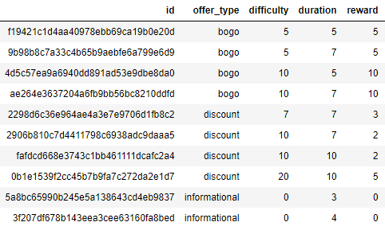
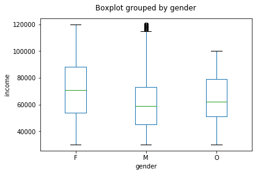

# Free Starbucks Cappucino, Anyone? #
This a Capstone project for the Udacity Datascience Nanodegree program.

## Table of Contents ##
1. [Motivation](#motivation)
2. Data Exploration
    1. [Types of Offers](#types_of_offers)
    2. [Customer Demographics](#customer_demographics)
    3. [Transaction Data](#transaction_data)
3. [Favorite or Flop](#favorite_or_flop)

## Motivation ##
Starbucks would like to know how its Rewards mobile app users (customers) respond to various promotional offers. Who is likely to make a purchase in response to an advertisement? Or a discount offer? Or a BOGO (buy one get one free)? Who is likely to make a purchase even if they don't receive an offer? 

This project seeks to answer the following specific questions:
1. Grouping of customers
2. Which are the most popular offers? Do some offers resonate with certain customer segments? Are there any offers that don't excite anybody? 
3. How well can a model predict which offers are likely to be well received?
4. Do any customer groups make purchase even if there are no offers?

## Data Exploration ##

### Types of Offers ###
Ten different types of offers are included in the study. Two of the offers are **informational** in nature. Completing an informational offer does not attract any specific reward. The project instructions state that an informational offers can be assumed to be 'influential' for a specified length of time once the app receives the offer. This could be debated - it would be more likely that the influence lasts for a certain period once the the user views the offer. Nevertheless, the project instruction has been honored in this analysis.

There are four of **discount** offers, differing in the minimum amount of money required to be spent (refered to as **difficulty**) to earn a reward, the amount of reward (refered to as **reward**) and the validity period (refered to as **duration**) of the offer.

Finally, there are four **bogo** (buy one get one free) offers. These, vary in difficulty and duration. The reward for a bogo offer is, of course, the same as the diffuculty.

Each offer is made to customers through one or more channels (mobile, social, web, email). The mobile app data available is available, per the project instructions. Accordingly, channel effects are not considered in this analysis.

### Customer Demographics ##  ###
The customer data set includes 17,000 mobile app customers. Age, income and gender are available for 14,825 customers (missing for 2,175 - approximately 13% - of all customers), while the membership date is available for all customers in the data set.

As seen below, almost all customers identify as either **F** or **M** gender. A very small portion of customers (1.4%) identify as **O** gender. The numbers of **F** and **M** customers is comparable and should not affect models based on gender, *but the very small fraction of **O** customers could cause models to ignore any age/income/membership year relationships characteristic of the **O** gender.*

Gender Distribution.

The age distributions for both **F** and **M** customers are skewed to the left. Further, there are relatively more **M** customers in the lower age and income groups than **F** customers.

Age Distribution by Gender.

Income Distribution by Gender.

Most of the customers in the study (63%) became (Rewards club) members in 2017 and 2018. The number of joiners declines rapidly as we go back in time. *Consequently, models may perform better with later joiners than early joiners.* Age, income and gender are missing for 4% of customers who became members in 2013 and 2014 and for roughly 13% of customers who joined after 2014. This is expected to slightly restore some balance. The lower number of 2018 joiners is presumably because the study was conducted in mid 2018.

Membership Year Distribution.

## Libraries/Packages ##
The following python packages are used:
1. numpy
2. pandas
3. json
4. matplotlib
5. tqdm
6. sklearn

## Authors ##
1. [Udacity](http://www.udacity.com) provided the Starbucks data files (portfolio.json; profile.json; transcript.json)
2. [Ashutosh A. Patwardhan](https://github.com/a1pat) created the Juputer notebook
