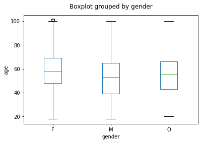
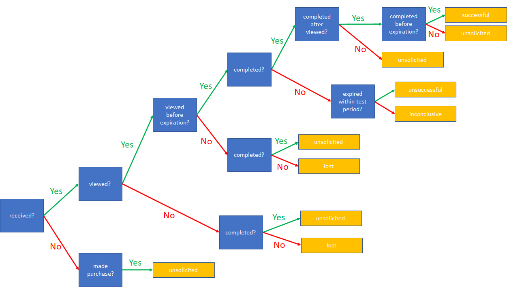
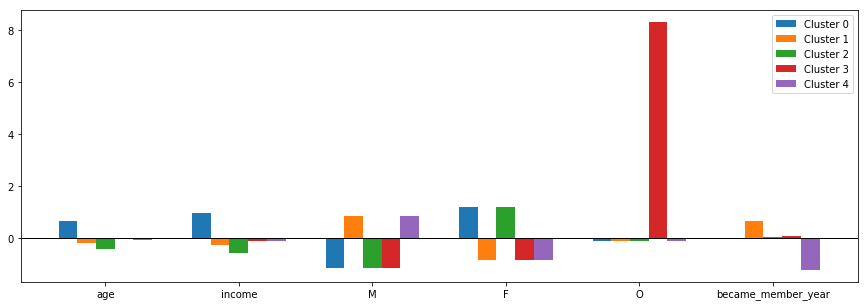

# Free Cappucino, Anyone? #
This a Capstone project for the Udacity Datascience Nanodegree program.

## Table of Contents ##
1. [Motivation](#motivation)
2. Data Exploration
    1. [Types of Offers](#types_of_offers)
    2. [Customer Demographics](#customer_demographics)
    3. [Transaction Data](#transaction_data)
3. [Demographic Groups](#demographic_groups)
    1. [PCA](#pca)
    2. [K-Means](#k_means)
4. [Potential Gotchas](#potential_gotchas)
5. [Fave or Flop](#fave_or_flop)

## Motivation ##
Starbucks would like to know how its Rewards mobile app users (customers) respond to various promotional offers. Who is likely to make a purchase in response to an advertisement? Or a discount offer? Or a BOGO (buy one get one free)? Who is likely to make a purchase even if they don't receive an offer? 

This project seeks to answer the following specific questions:
1. Grouping of customers
2. Which are the most popular offers? Do some offers resonate with certain customer segments? Are there any offers that don't excite anybody? 
3. How well can a model predict which offers are likely to be well received?
4. Do any customer groups make purchase even if there are no offers?

## Data Exploration ##

### Types of Offers ###
Ten different types of offers are included in the study. Two of the offers are **informational** in nature. Completing an informational offer does not earn a reward. The project instructions state that an informational offers can be assumed to be 'influential' for a specified length of time once the app receives the offer. This could be debated - it would be more likely that the influence lasts for a certain period once the the user views the offer. Nevertheless, the project instruction has been honored in this analysis.

There are four of **discount** offers, differing in the minimum amount of money required to be spent (refered to as **difficulty**) to earn a reward, the amount of reward (refered to as **reward**) and the validity period (refered to as **duration**) of the offer.

Finally, there are four **bogo** (buy one get one free) offers. These, vary in difficulty and duration. The reward for a bogo offer is, of course, the same as the diffuculty.

Each offer is made to customers through one or more channels (mobile, social, web, email). The mobile app data available is available, per the project instructions. Accordingly, channel effects are not considered in this analysis.

### Customer Demographics  ###
The customer data set includes 17,000 mobile app customers. Age, income and gender are available for 14,825 customers (missing for 2,175 - approximately 13% - of all customers), while the membership date is available for all customers in the data set.

As seen below, almost all customers identify as either **F** or **M** gender. A very small portion of customers (1.4%) identify as **O** gender. The numbers of **F** and **M** customers is comparable and should not affect models based on gender, *but the very small fraction of **O** customers could cause models to ignore any age/income/membership year relationships characteristic of the **O** gender.*

The age distributions for both **F** and **M** customers are skewed to the left. Further, there are relatively more **M** customers in the lower age and income groups than **F** customers.

Most of the customers in the study (63%) became (Rewards club) members in 2017 and 2018. The number of joiners declines rapidly as we go back in time. *Consequently, models may perform better with later joiners than early joiners.* Age, income and gender are missing for 4% of customers who became members in 2013 and 2014 and for roughly 13% of customers who joined after 2014. This is expected to slightly restore some balance. The lower number of 2018 joiners is presumably because the study was conducted in mid 2018.

Crossplots show behavior that may point to data collection issues:

The stair-step behavior of maximum income versus age is strange. While younger customers may well have lower average income is lower, their income distribution would probably have some samples in higher income ranges. Is it due to how the customer set was chosen for the study? The box plot shows no customers who signed up in 2013 and 2014 had income above $100,000. Perhaps the membership application did not provide the option to indicate a higher income? While the reasons for this unexpected behavior are not known with certainty, it could certainly impact model performance.

#### Missing Data Strategy ####

Age, income and gender year (all three attributes) data is missing for 13% of the participants. Filling these in using median values will simply create additional modeling bias by overloading one data point. It may have made sense to fill in using median values if different attributes were missing for different participants. Consequently, the missing-data rows in the profile data frame will not be used for modeling.

### Transaction Data  ###
Data for 306,534 transactions is provided in the transcript.json file. A transaction is a record of a purchase made via the app, or a record of an offer being received, viewed or completed via the app. A total of 76,277 offers were sent to all but six customers. Most customers received at least five offers, while some customers received as many as six offers. Each customer received at least one offer. Approximately 7,600 of each of the ten types of offers were sent out. Each offer was sent (received) at each of the following times: 0, 168, 336, 408, 504 and 576 though not to each customer. The last transaction is timestamped 714 - this is the end of the test, but not all offers expired by this time. Thus, some offers may have been viewed and completed after the test ended, and were not necessarily unsuccessful. In fact, each offer could have one of the outcomes shown in the following figure:

The outcomes are defined as follows:
1. **Successful**: the offer is viewed before completion, and completed before expiration;
2. **Unsuccessful**: the offer is viewed but not completed before expiration; expiration is within the duration of the test;
3. **Inconclusive**: the offer is viewed but not completed within the test period; expiration is after the end of the test period;
4. **Lost**: the offer was not viewed within the test period;
5. **Unsolicited**: this is a purchase made without receiving an offer, without viewing a received offer, or viewing and offer but making the purchase after offer expiration.

Classifying each offer/transaction according to the above scheme is important for assessing each offer. *It is also time consuming.* A flag (**read_saved_person_offer**) in the code can be set to True the first time the code is run to perform the categorization. The results are saved to a pickle file. The flag can be set to False during subsequent runs - this reads the categorization from the pickle file and saves time.

There is an issue with how the transcations are labeled in the transcript file, as illustrated by the following person's transactions. Check the events from t=504 onwards (the events prior to this are labeled correctly). There are two offers markerd as completed at t=600. Between them, these offers have a combined difficulty of $15. Yet, there is only one transaction at t=600 for $11.26. Thus the two offers could not have both been completed. There is a problem with at least some of the offers being marked as completed. The 'offer completed' tags must be re-done for this and all other persons.

As a quality check of the catehorization logic and code, it was verified that each offer received by each person falls into one and only one of the possible outcomes - successful, unsuccessful, unsolicited, inconclusive, lost;

## Demographic Groups ##
Customer data (from profile.json) are analyzed to determine if there are any natural demographic groups. Missing rows are dropped and all the remaining rows are used for this analysis. The goal is not to predict the group of future/unknown customers, hence separation into training and test sets is necessary. Such separation may be required in future if such prediction is contemplated.

Two popular methods are used to determine groups - PCA and K-Means, both using the scikit-learn package.

The following featue set is employed: ['age','income','M','F','O','became_member_year']. 'M', 'F' and 'O' are categorical variables derived from *gender*. 'became_member_year' is derived from 'became_member_on'.

### PCA  ###
Following scaling with scikit-learn's StandardScaler(), PCA shows that five principal components account for all the variation in the data set. This is not surprising since the three gender-related categorical variables are not linearly independent. The first principal component explains about 27% of the variation in the data, the next three principal components each explain about 20% of the variation, and the fifth principal component explains the balance. Five principal components have to be retained to explain the data adequately.

The loading matrix tells us how much each variable contributes to each principal component. It is shown below and is interpreted as follows:

1. **First principal component** (PC0, blue bars): **M* and **F** are the largest blue bars. They are in opposite directions, meaning that a customer can be either **M** or **F** (of course). The **age** and **income** bars are smaller and the same sign as the **F** bar. This means that **F** gender has slightly above-average age and income while **M** gender has slightly below-average age and income. This is consistent with earlier observations in the [Customer Demographics](#customer_demographics) section. **O** gender and **became_member_year** have no contribution to this principal component;
2. **Second principal component** (PC1, orange bars): This primarily shows that **age** and **income** vary together (positive correlation). To a lesser extent, lower **age** and **income** are associated with **F**, that is, there are **F**s with lower than average **age** and **income** and **M**s with above average **age** and **income**, but this is a secondary effect. It also shows that **O** gender generally has above-average **age** and **income**. To an even smaller extent, **F**s and **O**s joined relatively later while there are more **M**s among the early joiners;
3. **Third principal component** (PC2, green bars): primary contribution is from belonging to the **O** gender with very slightly above-average **age** and **income** and somewhat later joiners;
4. **Fourth principal component** (PC3, red bars): These are the very early joiners, not from any particular gender, with mostly average **age** and **income**;
5. **Fifth principal component** (PC4, purple bars): The are the higher **income** lower **age** (and vice versa) customers acrosss all genders and vintages.

Another nice way to visualize the above information is to plot make a scatter plot of two principal components' loading vectors, as shown below:

Observing which points are next to each other versus opposite each other relative to the origin:
1. **F** and **M** are opposites;
2. **Age** (blue dot) and **income** (orange dot) largely vary together, and somehwat opposite to **became_member_year**;
3. **O** gender are late joiners,

consistent with the first three principal components in the loadings bar chart.

### K-Means  ###
The K-Means algorithm separates the data into the specified (K) number of clusters, and yields the cluster centers. As a reminder, the features are **age**, **income**, **M**, **F**, **O** and **became_member_year**. Let us see what happens when we specify different numbers of clusters.

The following chart shows the mean value of each feature at the cluster center. 

The two clusters are primarily differentiated by **F** (blue bars) or **M** (orange bars). The **F** group has slightly-above-average age and income. The age and income of the **M** group is slightly below average. The membership year is not relevant. 

Jumping ahead to five clusters, the cluster membership is as follows:

1. **Cluster 1** (blue bars): contains **F**. The average age and income of this cluster are well above average;
2. **Cluster 2** (orange bars): contains **M**. The average age and income are slightly below average, and members are late joiners;
3. **Cluster 3** (green bars): members are **F**, this time with below-average age and income;
4. **Cluster 4** (red bars): stands out as having **O** members. Other features are not prominent in this cluster;
5. **Cluster 5** (purple bars): the membership is characterized by being of **F** gender and early joiners.

This is remarkably consistent with the groups arising from PCA.

Gender remains the primary differentiator as the number of K-Means clusters is increased further, but finer distinctions are drawn along age, income and became_member_year lines.

The **inertia** (sum of square of the distance from each point to its cluster center) is often used to determine the appropriate number of clusters. As seen below, there is no sharp 'elbow' in a plot of intertia versus number of clusters. **We will use five clusters in the remainder of this project**.

## Potential Gotchas ##

## Fave or Flop ##

The overall success rates for each of the offers is shown below.

| first figure | second figure |
|-------------|----------|
|  |  |

## Libraries/Packages ##
The following python packages are used:
1. numpy
2. pandas
3. json
4. matplotlib
5. tqdm
6. sklearn

## Authors ##
1. [Udacity](http://www.udacity.com) provided the Starbucks data files (portfolio.json; profile.json; transcript.json);
2. [Ashutosh A. Patwardhan](https://github.com/a1pat) did the data exploration, cleaning, modeling/classification and created the Juputer notebook.
